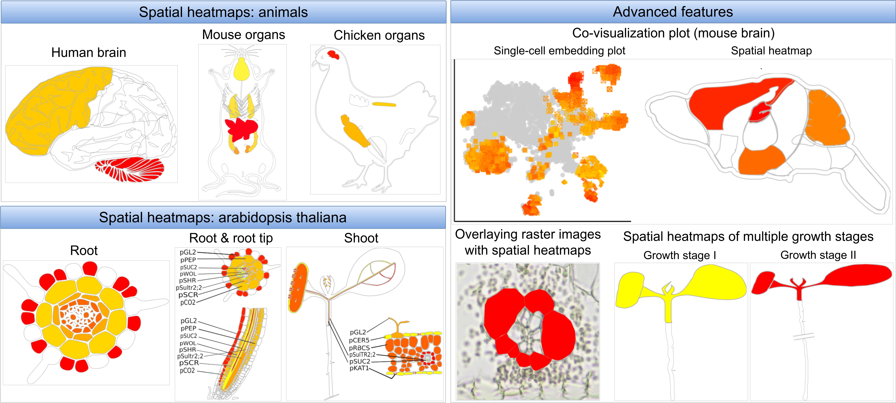

<style>

img {
  padding: 0px 2px 0px 2px !important
}
</style>
```{css, echo=FALSE}
pre code {
white-space: pre !important;
overflow-x: scroll !important;
word-break: keep-all !important;
word-wrap: initial !important;
}
```

```{r global_options, include=FALSE}
## ThG: chunk added to enable global knitr options. The below turns on
## caching for faster vignette re-build during text editing.
#knitr::opts_chunk$set(cache=TRUE)
```
<!-- 

<style type="text/css">
 .main-container { max-width: 1800px; margin-left: 5px; margin-right: auto; }
</style>

<style>body { text-align: justify }</style>  


```{r css, echo = FALSE, results = 'asis'}
BiocStyle::markdown(css.files=c('file/custom.css'))
```

-->

```{r setup0, eval=TRUE, echo=FALSE, message=FALSE, warning=FALSE}
library(knitr); opts_chunk$set(message=FALSE, warning=FALSE)
```
<center>

</center>
