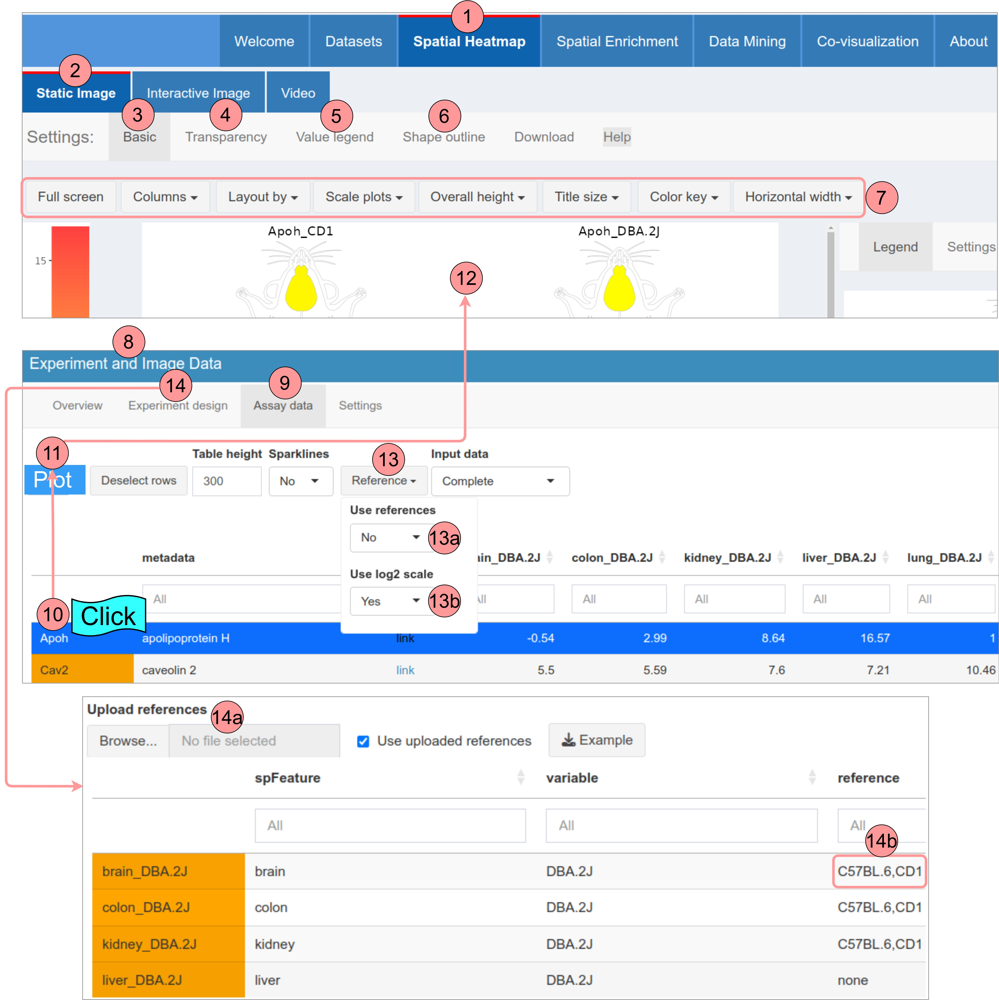
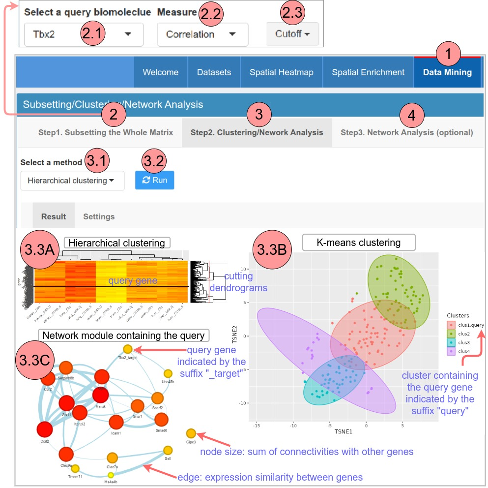

```{css, echo=FALSE}
pre code {
white-space: pre !important;
overflow-x: scroll !important;
word-break: keep-all !important;
word-wrap: initial !important;
}
```

```{r global_options, echo=FALSE, include=TRUE} 
## ThG: chunk added to enable global knitr options. The below turns on 
## caching for faster vignette re-build during text editing. 
knitr::opts_chunk$set(cache=TRUE) 
```  

<!-- 
<style type="text/css">
 .main-container { max-width: 1800px; margin-left: 5px; margin-right: auto; }
</style>

<style>body { text-align: justify }</style>  

```{r css, echo = FALSE, results = 'asis'}
BiocStyle::markdown(css.files=c('file/custom.css'))
```
-->

```{r setup0, eval=TRUE, echo=FALSE, message=FALSE, warning=FALSE}   
library(knitr); opts_chunk$set(message=FALSE, warning=FALSE) 
```

The *spatialHeatmap* Shiny App is the interactive implementation of the [*spatialHeatmap*](https://bioconductor.org/packages/devel/bioc/html/spatialHeatmap.html){target="_blank"} software, which is specialized in visualizing spatial bulk and single cell assays in anatomical images.  

# Datasets

```{r echo=FALSE, fig.wide=TRUE, out.width="100%", fig.cap=("Page for selecting datasets.")}  
include_graphics('image/data.jpg')  
```

1: The tab for selecting datasets (red line: current selected tab).  
2: The sub-tab for selecting datasets.  
3: Select dataset source.  
4: Instructions for formatting bulk data are provided [here](){target="_blank"}.  
<font style='color:blue'>[JH: links will be added later.]</font>  
5: Instructions for formatting bulk and single-cell data are provided [here](){target="_blank"}.   
6: Pre-configured datasets. Details of each portal is seen at the respective tooltips.  

# Spatial Heatmap

The spatial heatmap functionality is designed for visualizing cell-, tissue-, or organ-specific data (transcriptome, proteome, metabolome, etc) in anatomical images.  

## Static image

```{r echo=FALSE, fig.wide=TRUE, out.width="100%", fig.cap=("Settings for SHMs in form of static images.")}  
  
```

1: The tab displaying spatial heatmaps (red line: current selected tab).  
2: The tab displaying spatial heatmaps in form of static image.  
3: The most frequently used (basic) settings.  
4: Set spatial features transparent.   
5: Add numeric values corresponding to spatial features as bottom legend.  
6: Adjust spatial features outlines (widths, colors).  
7: Download spatial heatmaps. 8 See the respecitve popup tooltips.  
9: Area for displaying legend plot. 10. Settings for the legend plot.  
11: Tab displaying assay date.  
12: Settings for processing the assay data.  
13: Tab displaying the assay data in a table.  
14: Expression profiles of selected genes in 15 are displayed in a line graph.  
15-17: Selecting genes (15), click the button (16), then spatial heatmaps will be created in 17.   

## Interactive image

```{r echo=FALSE, fig.wide=TRUE, out.width="80%", fig.cap=("Settings for SHMs in form of interactive images.")}  
  
```

1: The tab displaying spatial heatmaps (red line: current selected tab).
2: The tab displaying spatial heatmaps in form of interactive images. 
3: The tab displaying interative images.
4: The settings for the interative spatial heatmap.
5: Click the "Run" button to show the interactive images.
6: See the respecitve popup tooltips.

## Video

```{r echo=FALSE, fig.wide=TRUE, out.width="80%", fig.cap=("Settings for SHMs in form of videos.")}  
include_graphics('image/video.jpg')  
```

1: The tab displaying spatial heatmaps (red line: current selected tab).
2: The tab displaying spatial heatmaps in form of videos. 
3: The tab displaying videos.
4: The settings for videos.
5: See the respecitve popup tooltips.

## Data mining

```{r ana, echo=FALSE, fig.wide=TRUE, out.width="100%", fig.cap=("Large scale data mining downstream sptial heatmaps.")}  
  
```

Although spatial heatmaps are powerful for visualization, only a few genes can be plotted simultaneously as each requires an individual plot. To overcome this limitation and support analysis routines involving a large number of genes, the Shiny App integrates functionalities for large-scale data mining, including hierarchical clustering, K-means clustering, and network analysis (Figure \@ref(fig:ana)), and spatial enrichment (Figure \@ref(fig:enrich)).   

1: The tab displaying spatial heatmaps (red line: current selected tab).  
2: The tab displaying data mining.   
3: Step1: to obtain genes showing expression similarity with a query gene in 3.1, the assay matrix can be subsetted by using similarity measures in 3.2 and a cutoff value in 3.3. The subsetted matrix will be passed to Step2. If no subsetting is applied, the whole matrix will be used in Step2.   
4: Step2: performing hierarchical clustering (4.4A), K-means clustering (4.4B), or network analysis (4.4C) on the subsetted matrix from step1 to identify a cluster of genes that showing highly similar expression patterns with the query.  

 * Select a data mining method in 4.1, adjust corresponding settings in 4.2 if needed, and click 4.3, then the cluster containing the query gene (3.1) will be shown in 4.4.   

 * Network analysis is performed with the WGCNA algorithm [@Langfelder2008-sg; @Ravasz2002-db]. The objective is to identify the network module containin the query that can be visualized in form of network graphs. See more details [here](https://bioconductor.org/packages/devel/bioc/vignettes/spatialHeatmap/inst/doc/spatialHeatmap.html#43_Network_Graphs){target="_blank"}.  

5: Step3: optional further network analysis on the cluster in 8. This tab is disabled until the cluster is shown in 8.   

# Spatial Enrichment

```{r enrich, echo=FALSE, fig.wide=TRUE, out.width="100%", fig.cap=("Sptial enrichment.")}  
include_graphics('image/enrich.jpg')  
```

The spatial enrichment module identifie spatially enriched or depleted genes that are significantly up- or down- regulated in one feature (e.g. tissue) relative to the reference features, and their abundance values are visualized as enrichment spatial heatmaps. Similarly, genes enriched or depleted in one experimental variable (e.g. treatments) compared to reference variables can be detected and visualized.    

1: The tab displaying spatial enrichment (red line: current selected tab).  
2: The settings for spatial enrichment. 

  * The input data (2.14) are pre-processed: genes with expression values over a cutoff (2.2) across at least a proportion (2.3) of samples and coefficient of variance (CV) within a range (2.4, 2.5) are retained, next, the assay data are normalized (2.6).   

  * Spatial features and experimental variables (e.g. treatments) are listed in 2.7 and 2.8 respectively. Only those chosen will be considered for spatial enrichment. If the comparison (2.9) is across spatial features, variables under the same spatial feature will be treated as replicates, and vice versa.   

  * The stringency of spatial enrichment can be relaxed by allowing a user-definable number of outliers (2.10) in reference features. The methods (2.11) for spatial enrichment include differential expression analysis tools of edgeR [@edgeR], limma [@limma], DESeq2 [@deseq2], and distinct [@distinct]. The top up- or down-regulated genes can be selected by log2-fold change (2.12, e.g. $\geq$ 1) and FDR (2.13, e.g. $\leq$ 0.05).  

  * By clicking "Run" (2.1), all-against-all comparisons will be performed according these settings.   

3: Summary of results

  * The enrichment results among spatial features are compared in three types of plots (3.6). The results can be queried by choosing a feature in 3.1 that contains selected features in 2.7, and the other features in 3.1 will be regarded as references (3.5). Note, variables (2.8) are treated as replicates (3.4).   

4: Results of the query feature

  * The enrichment results of the query feature (3.3) are displayed in a table (4.2). By clicking "Enrichment SHMs" (4.1), the table will be sent to the "Spatial Enrichment" tab for visualization.  

# Co-visualization

The co-visualization module provides novel plotting functionalities designed to gain insights into tissue-level organizations of single-cell data, or vice versa cellular compositions of tissues (Figure \@ref(fig:man).9.5-9.6). It combines spatial heatmaps and embedding plots where matching tissues and cells are associated by identical point colors. The coloring (Figure \@ref(fig:man).9.3) of the single cells (dots) and tissue features can be based on quantitative values (heat coloring) or fixed group-based colors. Cell group labels are required for the cell-feature matching. This includes support for existing cell annotations, marker gene-based methods, manual assignments, and automated co-clustering of bulk and single-cell data (Figure \@ref(fig:auto).A-E).   

Since there are often differences in naming conventions between cell group labels and tissue labels for the the first four methods, the user interface for cell labels obtained by these methods utilizes a ranslation map to create a bridge between the cell and tissue labels (Figure \@ref(fig:man).7.2-7.4). By contrast, the co-clustering method directly groups cells based on tissue labels, so the cell groups and tissues already have programatically identical labels. Due to this inherent alignment, the user interface for the co-clustering method is designed separately (Figure \@ref(fig:auto)).    

## Interace for annotation (or similar) labels  

1: The tab for co-visualization (red line: current selected tab).   
2: Methods for obtaining cell group labels. The option "Annotation (or similar) labels" and "Co-clustering" will introcude the interface in Figure \@ref(fig:man) and Figure Figure \@ref(fig:auto) respectively.  
3: The "Cell-to-bulk" option: When choosing "Annotation (or similar) labels" in 2, the user interface is built in a way that spatial features can be dragged and dropped under desired cell group labels (7.2-7.4). When choosing the "cell-by-group" coloring option in 9.3, heat colors will be derived from the single-cell data. Vice versa for the "Bulk-to-cell" option.   
4: Settings: the bulk and single-cell assay data can be pre-processed according to the settings in 4.    
5: The bulk and single-cell assay data are provided in 5.  
6: The metadata (`colData` slot of `SingleCellExperiment`) of single cells are provided in 6.4. In the embedding plot, single cells are colored according to the chosen group label in 6.1. By selecing rows in 6.4 and clicking 6.2, the selected cells will be highlighted in the embedding plot.    

```{r man, echo=FALSE, fig.wide=TRUE, out.width="100%", fig.cap=("Co-visualizing bulk and single-cell data using annotation (or similar) labels.")}  
include_graphics('image/man.jpg')  
```
7: Clicking tab 7 will show the interface for maching cells and tissue features. Spatial features in the aSVG are shown in 7.2 and cell group labels are shown in 7.3. By dragging one or multiple spatial features to the desired cell labels (7.4), the cell-tissue matching will be established for subsequent co-visualization. Then clicking "Run" (7.5) will turn the page to Spatial Heatmap automatically for co-visualization (9).  
8: The method for obtaining cell group labels (2) and mapping direction (3) is shown on the top for tracking.   
9, 9.1, 9.2: The tabs/settings for co-visualization.  
9.3: Coloring options for 9.5 and 9.6:   

  * Cell-by-value: cells in 9.5 and tissues in 9.6 are colored independently according to expression values of a chosen gene in single-cell and bulk data respectively.  
  * Cell-by-group: expression values of a chosen gene in single-cell data are averaged by cell groups. The same heat color derived from the averaged value will be assigned to cells of the same group and matching tissues.    
  * Feature-by-group: expression values of a chosen gene in bulk data are averaged by replicates. The same heat color derived from the averaged value will be assigned to the tissue feature and matching cells.   
  * Fixed-by-group: cells of the same group and matching tissue features are assigned the same constant colors.   

9.4-9.6: Single-cell and bulk data are visualized in an embedding plot (9.5) and a spatial heatmap (9.6) respectively. In 9.5, grey dots represent cells not matched with any tissue feature (7.4). All cell group labels that are matched with tissue features (7.4) are listed in 9.4, where options are provided to visualized all (default) or a single group in 9.5.  

## Interface for co-clustering

1-3: 1 and 3 are the same as Figure \@ref(fig:man). Selecting "Co-clustering labels" (2) will introduce the interface for co-clustering (Figure \@ref(fig:auto)).   
5: Tab dislaying bulk and single-cell data.  
6: Tab displaying co-clustering (see [below](#illus)) results in form an embedding plot and a table (6.6). The bulk labels assigned to cells and corresponding similarities (Spearman's correlation coefficients) are shown in 6.4 and 6.5. All (default) or a chosen cluster can be selected (6.2) to show in the embedding plot. Selecting rows in 6.6 and clicking 6.1 will highlight corresponding cells/tissues in the embedding plot. Clicking 6.3 will automatically turn the page to "Spatial Heatmap" for co-visualization, which is the same as Figure \@ref(fig:man).  

```{r auto, echo=FALSE, fig.wide=TRUE, out.width="100%", fig.cap=("Co-visualizing bulk and single-cell data using co-clustering labels.")}  
include_graphics('image/auto.jpg')  
```

<a name="illus"></a>
4: Co-clustering settings and illustrations:
  
  * 4.1: Clicking this button will perform the co-clustering process (7).   

  * Although the co-clustering method (7) is generally applicable to various types of data modalities (transcriptome, proteome, metabolome, etc), it is specifically explained using RNA-seq data. Initially, the raw count matrices of bulk and single cells are combined column-wise for joint normalization (4.2, 7A) using *scater* and *scran* [@scater; @scran].  

  * 4.3: Following separation from the single-cell data, for the bulk data, genes are filtered based on their expression values exceeding a cutoff (A) across a minimum proportion (P) of bulk samples, and their coefficient of variance (CV) falls within a range (CV1, CV2). On the other hand, the single-cell data are filtered to include genes with robust expression ($\geq$ cutoff) across a certain proportion of cells (P2) and cells with robust expression across a certain proportion of genes (P1). Next, the bulk data is subsetted to include the same set of genes as the single-cell data to reduce sparsity in the latter and make these two types of data more comparable (7A3).   

  * 4.4/7B: In the subsequent step, the bulk and single-cell data are combined column-wise for joint embedding using a dimensionality reduction technique (PCA or UMAP).   
  * 4.5/7C: Co-clustering is then performed on the top joint dimensions. Specifically, a graph is built with methods from *scran* where nodes are cells (or tissues) and edges are connections between nearest neighbors [@scran], and subsequently this graph is partitioned with *igraph* to obtain clusters [@igraph]. Three types of clusters are shown: (i) multiple cells are co-clustered and assigned to one bulk tissue sample (7C1); (ii) multiple cells are co-clustered with several bulk tissues, and then assigned to a single bulk tissue with a nearest-neighbor approach (7C2), which is based on the Spearman's correlation coefficient (similarity, 11); and (iii) cells that do not co-cluster with any bulk tissue remain unassigned (7C3). 
  * 7D-E: After co-clustering, cells are labeled by bulk tissues or remain un-labeled ("none" in 7D). Lastly, the obtained labels are subsequently used to match cells with tissues in embedding and spatial heatmaps, respectively (7E).    

# Reference


