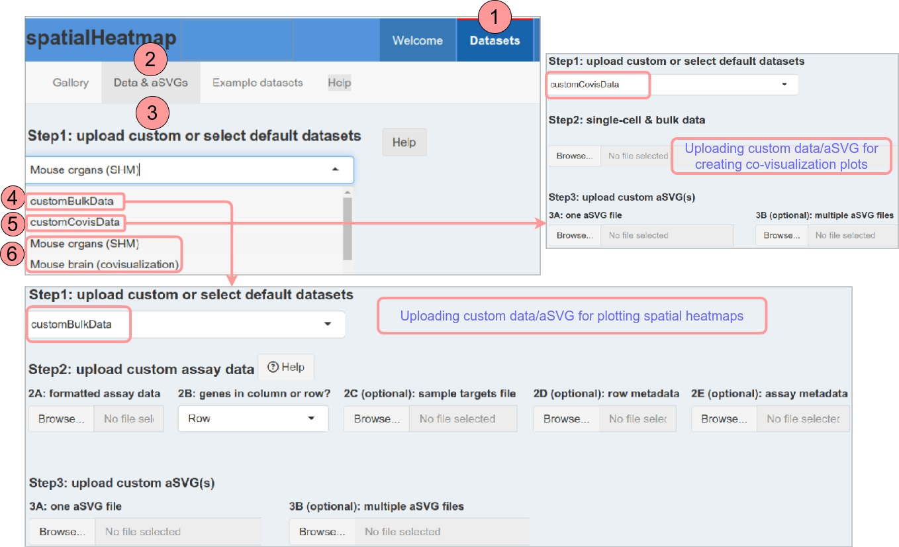
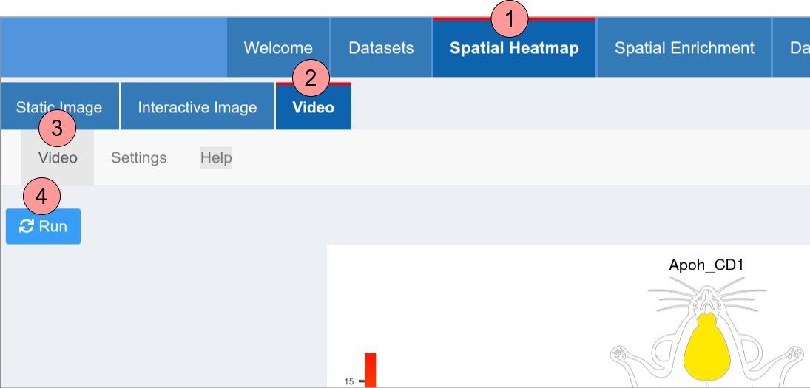
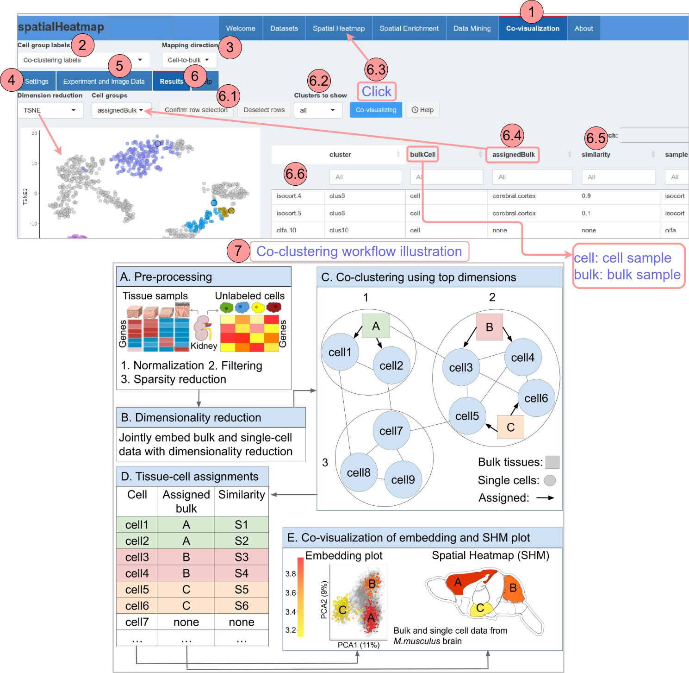

```{css, echo=FALSE}
pre code {
white-space: pre !important;
overflow-x: scroll !important;
word-break: keep-all !important;
word-wrap: initial !important;
}
```

```{r global_options, echo=FALSE, include=TRUE} 
## ThG: chunk added to enable global knitr options. The below turns on 
## caching for faster vignette re-build during text editing. 
knitr::opts_chunk$set(cache=TRUE) 
```  

<!-- 
<style type="text/css">
 .main-container { max-width: 1800px; margin-left: 5px; margin-right: auto; }
</style>

<style>body { text-align: justify }</style>  

```{r css, echo = FALSE, results = 'asis'}
BiocStyle::markdown(css.files=c('file/custom.css'))
```
-->

```{r setup0, eval=TRUE, echo=FALSE, message=FALSE, warning=FALSE}   
library(knitr); opts_chunk$set(message=FALSE, warning=FALSE) 
```

The *spatialHeatmap* Shiny App is the interactive implementation of most functionalities in the [*spatialHeatmap*](https://bioconductor.org/packages/devel/bioc/html/spatialHeatmap.html){target="_blank"} software, which is specialized in visualizing spatial bulk and single cell assays in anatomical images. This user manual introduces the most important features and most basic operations of this App.     

# Datasets

This tab is designed for selecting pre-configured datasets or uploading custom datasets.   
<strong> Quick start: Select a pre-configured dataset (6) and click "Spatial Heatmap" (then select genes in the table to see spatial heatmaps).</strong>       

Figure \@ref(fig:data).1-3: Go to Figure \@ref(fig:data).1-3 (top red line: current selected tab) to select/upload a dataset, and click "Spatial Heatmap" to see spatial heatmaps.     
Figure \@ref(fig:data).4-5: Upload custom datasets. Details of each portal is seen at the respective tooltips. To format custom bulk data, please refer to instructions available [here](https://bioconductor.org/packages/devel/bioc/vignettes/spatialHeatmap/inst/doc/spatialHeatmap.html#611_Object_Types). For formatting both bulk and single-cell data, instructions are provided [here](https://bioconductor.org/packages/devel/bioc/vignettes/spatialHeatmap/inst/doc/covisualize.html#5_Shiny_App). To format anatomical images, guidelines are provided [here](https://bioconductor.org/packages/devel/bioc/vignettes/spatialHeatmap/inst/doc/spatialHeatmap.html#13_Image_Format:_SVG).    
Figure \@ref(fig:data).6: Instead of uploading custom datasets, select pre-configured datasets.    

```{r data, echo=FALSE, fig.wide=TRUE, out.width="100%", fig.cap=("Page for selecting datasets.")}  
  
```

# Spatial Heatmap

The spatial heatmap functionality is designed for coloring color spatial features (e.g. tissues) annotated in SVG images (aSVGs) based on the quantitative abundance levels of biomolecules (e.g. mRNAs) using a color key. The resulting plot is called a spatial heatmap (SHM). This tab includes different output forms of SHMs.   

## Static image

This tab display SHMs in form of static images.   

<strong> Quick start: Select genes (10) in the table and click "Plot (11)".</strong>      

Figure \@ref(fig:static).1-2: Go to tabs displaying SHMs in form of static images.    

Customize SHMs use settings in Figure \@ref(fig:static).3-7: 

  * Figure \@ref(fig:static).3: The most frequently used (basic) settings.  
  * Figure \@ref(fig:static).4: Set selected spatial features transparent.   
  * Figure \@ref(fig:static).5: Add heat colors and numeric values as secondary legend at the bottom of each spatial heatmap.   
  * Figure \@ref(fig:static).6: Adjust spatial features outlines (widths, colors).  
  * Figure \@ref(fig:static).7: See respective pop-up tooltips.  

```{r static, echo=FALSE, fig.wide=TRUE, out.width="100%", fig.cap=("Settings for SHMs in form of static images.")}  
include_graphics('image/static.jpg')  
```

Figure \@ref(fig:static).8-9: The input assay data.  
Figure \@ref(fig:static).10-12: Select genes (Figure \@ref(fig:static).10), click the button (Figure \@ref(fig:static).11), then spatial heatmaps will be created (Figure \@ref(fig:static).12).  

Figure \@ref(fig:static).13-15: In the Experiment design (Figure \@ref(fig:static).14), reference experiment variables can be uploaded in a one-column table (Figure \@ref(fig:static).14a), where multiple variables needs to be formatted in comma-separated strings (Figure \@ref(fig:static).14b). These references will be include in the "reference" column (Figure \@ref(fig:static).14b). Selecting "Yes" in Figure \@ref(fig:static).13a will computes relative expression levels, which can be toggled by "No". For example, after selecting "Yes" (Figure \@ref(fig:static).13), relative expression levels in brain under "DBA.2J" will be computed based on "C57BL" and "CD1", respectively. Selecting "Yes" and "No" in Figure \@ref(fig:static).13b will computes log2-transformed and raw relative expression levels, respectively, such as log2(treatment/control) and treatment/control.  

## Interactive image

```{r inter, echo=FALSE, fig.wide=TRUE, out.width="80%", fig.cap=("Settings for SHMs in form of interactive images.")}  
include_graphics('image/inter.jpg')  
```

Figure \@ref(fig:inter).1-3: Go to tabs displaying SHMs in form of interactive images (top red line: current selected tab).   
Figure \@ref(fig:inter).4: Click the "Run" button to show the interactive images.  
Figure \@ref(fig:inter).5: Click the "Play" button to show images sequentially.  

## Video

```{r video, echo=FALSE, fig.wide=TRUE, out.width="80%", fig.cap=("Settings for SHMs in form of videos.")}  
  
```

Figure \@ref(fig:video).1-3: Go to tabs displaying SHMs in form of videos (top red line: current selected tab).   
Figure \@ref(fig:video).4: Click the "Run" button to show the videos.  

# Spatial Enrichment

The spatial enrichment module identifies spatially enriched or depleted genes that are significantly up- or down- regulated in one feature (e.g. tissue) relative to reference features, and their abundance values are visualized as enrichment SHMs. Similarly, genes enriched or depleted in one experimental variable (e.g. treatments) relative to reference variables can also be detected and visualized.    

<strong>Quick start: Click "Run" (Figure \@ref(fig:enrich).2.1) to perform spatial enrichment for each selected spatial features (Figure \@ref(fig:enrich).2.3), select a query feature (Figure \@ref(fig:enrich).3.1) to get corresponding results (Figure \@ref(fig:enrich).4.2), click Figure \@ref(fig:enrich).4.1 to create enrichment SHMs. </strong>   

Figure \@ref(fig:enrich).1: Go to the tab displaying spatial enrichment (top red line: current selected tab).  
Figure \@ref(fig:enrich).2: Perform spatial enrichment according to the settings:  

  * The input data are pre-processed: genes with expression values over a cutoff (Figure \@ref(fig:enrich).2.2A) across at least a proportion (Figure \@ref(fig:enrich).2.2P) of samples and coefficient of variance (CV) within a range (Figure \@ref(fig:enrich).2.2CV1, CV2) are retained. Then the assay data are normalized.    

  * Spatial features and experimental variables (e.g. treatments) are listed in 2.3 and 2.4 respectively. Only those chosen will be considered for spatial enrichment. If the comparison (2.5) is across spatial features, variables under the same spatial feature will be treated as replicates, and vice versa.   

  * The stringency of spatial enrichment can be relaxed by allowing a number of outliers (Figure \@ref(fig:enrich).2.6) in reference features. The methods (Figure \@ref(fig:enrich).2.7) for spatial enrichment include differential expression analysis tools of edgeR [@edgeR], limma [@limma], DESeq2 [@deseq2], and distinct [@distinct]. The top up- or down-regulated genes can be selected by log2-fold change (e.g. $\geq$ 1) and FDR (Figure \@ref(fig:enrich).2.8, e.g. $\leq$ 0.05).  

  * By clicking "Run" (Figure \@ref(fig:enrich).2.1), all-against-all comparisons will be performed according to these settings.   

```{r enrich, echo=FALSE, fig.wide=TRUE, out.width="100%", fig.cap=("Spatial enrichment.")}  
include_graphics('image/enrich.jpg')  
```

Figure \@ref(fig:enrich).3: Query the results   

  * The enrichment results among spatial features (Figure \@ref(fig:enrich).2.3) are compared in three types of plots. The results can be queried by choosing a feature in Figure \@ref(fig:enrich).3.1, where all selected features (Figure \@ref(fig:enrich).2.3) are listed, while the other features in Figure \@ref(fig:enrich).3.1 will be regarded as references (Figure \@ref(fig:enrich).3.2). Note, variables (Figure \@ref(fig:enrich).2.4) are treated as replicates (Figure \@ref(fig:enrich).3.4).     

Figure \@ref(fig:enrich).4: Results of the query feature

  * The enrichment results of the query feature (Figure \@ref(fig:enrich).3.1) are displayed in a table (Figure \@ref(fig:enrich).4.2). By clicking "Enrichment SHMs" (Figure \@ref(fig:enrich).4.1), the table will be sent to the "Spatial Enrichment" tab for visualization.  

# Data mining

Although SHMs are powerful for visualization, only a few genes can be plotted simultaneously as each requires an individual plot. To overcome this limitation and support analysis routines involving a large number of genes, the Shiny App integrates functionalities for large-scale data mining, including hierarchical clustering, K-means clustering, and network analysis (Figure \@ref(fig:ana)).    

<strong>Quick start: Click "Run" (Figure \@ref(fig:ana).3.2) to identfify the cluster containing the query gene (Figure \@ref(fig:ana).2.1) chosen from SHMs.</strong>    

Figure \@ref(fig:ana).1: Go the tab displaying the data mining interface.     
Figure \@ref(fig:ana).2: Step1: To obtain genes showing expression similarity with a query gene chosen from SHMs (Figure \@ref(fig:ana).2.1), the complete assay data can be subsetted using a similarity measure (Figure \@ref(fig:ana).2.2) and a cutoff (Figure \@ref(fig:ana).2.3). The subsetted matrix will be passed to Step2. If no subsetting is applied, the whole matrix will be used in Step2.   

```{r ana, echo=FALSE, fig.wide=TRUE, out.width="100%", fig.cap=("Large-scale data mining downstream sptial heatmaps.")}  
include_graphics('image/ana.jpg')  
```

Figure \@ref(fig:ana).3: Step2: Select a method (Figure \@ref(fig:ana).3.1) and click "Run" (Figure \@ref(fig:ana).3.2), then a cluster or network module showing highly similar expression patterns with the query will be identified in the subsetted matrix from step1, and the results will be shown in Figure \@ref(fig:ana).3.3A-C respectively.  
  
  Network analysis is performed with the WGCNA algorithm [@Langfelder2008-sg; @Ravasz2002-db]. The objective is to identify the network module containin the query that can be visualized in form of network graphs. See more details [here](https://bioconductor.org/packages/devel/bioc/vignettes/spatialHeatmap/inst/doc/spatialHeatmap.html#43_Network_Graphs){target="_blank"}.  

Figure \@ref(fig:ana).4: Step3: Perform optional further network analysis on the cluster containing the query (Figure \@ref(fig:ana).3.3A-B) from step2. This tab is disabled until the cluster is shown (Figure \@ref(fig:ana).3.3A-B).     


# Co-visualization

The co-visualization module provides novel plotting functionalities designed to gain insights into tissue-level organizations of single-cell data, or vice versa cellular compositions of tissues (Figure \@ref(fig:ann).9.5-9.6). It combines SHMs and embedding plots where matching tissues and cells are associated by identical point colors. The coloring (Figure \@ref(fig:ann).9.3) of the single cells (dots) and tissue features can be based on quantitative values (heat coloring) or fixed group-based colors. Cell group labels are required for the cell-tissue matching. This includes support for existing cell annotations, marker gene-based methods, manual assignments, and co-clustering of bulk and single-cell data (Figure \@ref(fig:auto).7).   

When using the first four methods, there are often differences in naming conventions between cell group labels and tissue labels, so the user interface for cell labels obtained by these methods utilizes a ranslation map to create a bridge between the cell and tissue labels (Figure \@ref(fig:ann).7.2-7.4). By contrast, the co-clustering method directly groups cells using source tissue labels, so the cell groups and tissues already have programatically identical labels. Due to this inherent alignment, the user interface for the co-clustering method is designed separately (Figure \@ref(fig:auto)).    

<a name="ann"></a>

## Interface for annotation (or other) labels  

This user interface (Figure \@ref(fig:ann).1-7) is designed for cell group labels from existing cell annotations, marker gene-based methods, manual assignments, etc.  

<strong> Quick start: Select "Annotation (or other) labels" (Figure \@ref(fig:ann).2), have an overview on the single-cell data (Figure \@ref(fig:ann).6), match cells and tissues (Figure \@ref(fig:ann).7), and click "Run" (Figure \@ref(fig:ann).7.5) to create co-visualization plots.    
</strong>

Figure \@ref(fig:ann).1: Go to the tab for co-visualization (red line: current selected tab).   
Figure \@ref(fig:ann).2: Select the source of cell group labels. The option "Annotation (or other) labels" and "Co-clustering" will introcude the interface in Figure \@ref(fig:ann) and Figure Figure \@ref(fig:auto) respectively.  
Figure \@ref(fig:ann).3: In the "Cell-to-bulk" option, when choosing the "cell-by-group" coloring option in 9.3, the heat colors will be derived from the single-cell data. Vice versa for the "Bulk-to-cell" option.  
Figure \@ref(fig:ann).4-5: Go to Figure \@ref(fig:ann).4 to pre-process the bulk and single-cell assay data if needed, which will be provided in tables in Figure \@ref(fig:ann).5.    
Figure \@ref(fig:ann).6: This tab is designed for exploring the single cell data before going to Figure \@ref(fig:ann).7. The metadata (`colData` slot of `SingleCellExperiment`) are provided in Figure \@ref(fig:ann).6.4. In the embedding plot, single cells are colored according to the chosen group label in Figure \@ref(fig:ann).6.1. By selecing rows in Figure \@ref(fig:ann).6.4 and clicking Figure \@ref(fig:ann).6.2, the selected cells will be highlighted in the embedding plot.    

```{r ann, echo=FALSE, fig.wide=TRUE, out.width="100%", fig.cap=("Co-visualizing bulk and single-cell data using annotation (or other) labels.")}  
  
```

Figure \@ref(fig:ann).7: After having an understanding of single-cell data in Figure \@ref(fig:ann).6, click Figure \@ref(fig:ann).7 to mactch cells and tissue features. By dragging (Figure \@ref(fig:ann).7.4) one or multiple spatial features (Figure \@ref(fig:ann).7.2) to the desired cell labels (Figure \@ref(fig:ann).7.3), the cell-tissue matching will be established for subsequent co-visualization. Then clicking "Run" (Figure \@ref(fig:ann).7.5) will turn the page to Spatial Heatmap automatically for co-visualization (Figure \@ref(fig:ann).9).   
Figure \@ref(fig:ann).8: The source of cell group labels (Figure \@ref(fig:ann).2) and mapping direction (Figure \@ref(fig:ann).3) is shown in a box for tracking.   
Figure \@ref(fig:ann).9.1-9.2: Go to the tabs/settings for co-visualization.   
Figure \@ref(fig:ann).9.3: Select coloring options for co-visualization plots (Figure \@ref(fig:ann).9.5-9.6):   

  * Cell-by-value: cells in Figure \@ref(fig:ann).9.5 and tissues in Figure \@ref(fig:ann).9.6 are colored independently according to expression values of a chosen gene in single-cell and bulk data respectively. This option provides the most detailed information in the plots.     
  * Cell-by-group: expression values of a chosen gene in single-cell data are averaged by cell groups. The same heat color derived from the averaged value will be assigned to cells of the same group and matching tissues.    
  * Feature-by-group: similar with "Cell-by-group" except that the averaged expression values are from the bulk data.    
  * Fixed-by-group: cells of the same group and matching tissue features are assigned the same constant colors.   

Figure \@ref(fig:ann).9.4-9.6: Single-cell and bulk data are visualized in an embedding plot (Figure \@ref(fig:ann).9.5) and an SHM (Figure \@ref(fig:ann).9.6) respectively. In Figure \@ref(fig:ann).9.5, grey dots represent cells not matched with any tissue feature (Figure \@ref(fig:ann).7.4). All cell group labels that are matched with tissue features (Figure \@ref(fig:ann).7.4) are listed in Figure \@ref(fig:ann).9.4, where options are provided to visualized all (default) or a single group in Figure \@ref(fig:ann).9.5.  

<a name="coclus"></a>

## Interface for co-clustering

This user interface is designed for co-clustering only.  

<strong>
Quick start: Have an overview on the co-clustering results (Figure \@ref(fig:auto).6), then click "Co-visualizing" (Figure \@ref(fig:auto).6.3) to create co-visualization plots.   
</strong>

Figure \@ref(fig:auto).1-3: Figure \@ref(fig:auto).1-3 are the same as Figure \@ref(fig:ann). Select "Co-clustering labels" (Figure \@ref(fig:auto).2) to display the interface for co-clustering (Figure \@ref(fig:auto)).   
Figure \@ref(fig:auto).4-5: The co-clustering workflow (Figure \@ref(fig:auto).7, see [below](#illus)) is performed according to settings in Figure \@ref(fig:auto).4. The bulk and single-cell assay data are displayed in Figure \@ref(fig:auto).5.   
Figure \@ref(fig:auto).6: Before co-visualization, go to this tab to see co-clustering (see [below](#illus)) results in form an embedding plot and a table (Figure \@ref(fig:auto).6.6). The bulk labels assigned to cells and corresponding similarities (Spearman's correlation coefficients) are shown in Figure \@ref(fig:auto).6.4 and Figure \@ref(fig:auto).6.5 respectively, where "none" denotes no assignments. All (default) or a chosen cluster can be selected (Figure \@ref(fig:auto).6.2) to show in the embedding plot. Selecting rows in Figure \@ref(fig:auto).6.6 and clicking Figure \@ref(fig:auto).6.1 will highlight corresponding cells/tissues in the embedding plot. Clicking Figure \@ref(fig:auto).6.3 will automatically turn the page to "Spatial Heatmap" for co-visualization, which is the same as Figure \@ref(fig:ann).9.    

```{r auto, echo=FALSE, fig.wide=TRUE, out.width="100%", fig.cap=("Co-visualizing bulk and single-cell data using co-clustering labels.")}  
  
```

<a name="illus"></a>

Figure \@ref(fig:auto).7: Co-clustering illustration:

  * Although the co-clustering method (Figure \@ref(fig:auto).7) is generally applicable to various types of data modalities (transcriptome, proteome, metabolome, etc), it is specifically explained using RNA-seq data. Initially, the raw count matrices of bulk and single cells are combined column-wise for joint normalization (Figure \@ref(fig:auto).7A1) using *scater* and *scran* [@scater; @scran].  

  * Figure \@ref(fig:auto).7A: Following separation from the single-cell data, for the bulk data, genes are filtered based on their expression values exceeding a cutoff across a certain proportion of bulk samples, and their coefficient of variance (CV) falls within a range (CV1, CV2). On the other hand, the single-cell data are filtered to include genes with robust expression ($\geq$ cutoff) across a certain proportion of cells and cells with robust expression across a certain proportion of genes (Figure \@ref(fig:auto).7A2). Next, the bulk data is subsetted to include the same set of genes as the single-cell data to reduce sparsity in the latter and make these two types of data more comparable (Figure \@ref(fig:auto).7A3).   

  * Figure \@ref(fig:auto).7B: In the subsequent step, the bulk and single-cell data are combined column-wise for joint embedding using a dimensionality reduction technique (PCA or UMAP).   
  * Figure \@ref(fig:auto).7C: Co-clustering is then performed on the top joint dimensions. Specifically, a graph is built with methods (*buildKNNGraph* or *buildSNNGraph*) from *scran* where nodes are cells (or tissues) and edges are connections between nearest neighbors [@scran], and subsequently this graph is partitioned with methods (*cluster_walktrap*, *cluster_fast_greedy*, or *cluster_leading_eigen*) from *igraph* to obtain clusters [@igraph]. Three types of clusters are shown: (i) multiple cells are co-clustered and assigned to one bulk tissue sample (Figure \@ref(fig:auto).7C1); (ii) multiple cells are co-clustered with several bulk tissues, and then assigned to a single bulk tissue with a nearest-neighbor approach (Figure \@ref(fig:auto).7C2), which is based on the Spearman's correlation coefficient (similarity, Figure \@ref(fig:auto).6.5); and (iii) cells that do not co-cluster with any bulk tissue remain unassigned (Figure \@ref(fig:auto).7C3).   
  * Figure \@ref(fig:auto).7D-E: After co-clustering, cells are labeled by bulk tissues or remain un-labeled ("none" in Figure \@ref(fig:auto).7D). Lastly, the obtained labels are subsequently used to match cells with tissues in embedding and SHMs, respectively (Figure \@ref(fig:auto).7E).    

# Reference


