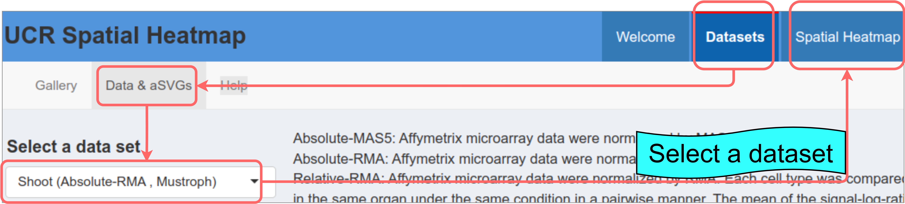
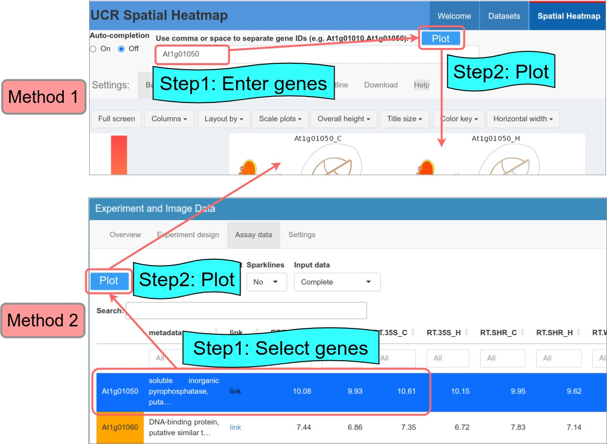

```{css, echo=FALSE}
pre code {
white-space: pre !important;
overflow-x: scroll !important;
word-break: keep-all !important;
word-wrap: initial !important;
}
```

```{r global_options, echo=FALSE, include=TRUE} 
## ThG: chunk added to enable global knitr options. The below turns on 
## caching for faster vignette re-build during text editing. 
knitr::opts_chunk$set(cache=TRUE) 
```  

<!-- 
<style type="text/css">
 .main-container { max-width: 1800px; margin-left: 5px; margin-right: auto; }
</style>

<style>body { text-align: justify }</style>  

```{r css, echo = FALSE, results = 'asis'}
BiocStyle::markdown(css.files=c('file/custom.css'))
```
-->

```{r setup0, eval=TRUE, echo=FALSE, message=FALSE, warning=FALSE}   
library(knitr); opts_chunk$set(message=FALSE, warning=FALSE) 
```


# Datasets

<strong> Quick start: Select a pre-configured dataset and click "Spatial Heatmap".</strong>       


```{r data, echo=FALSE, fig.wide=TRUE, out.width="100%", fig.cap=("Page for selecting datasets.")}  
  
```

# Spatial Heatmap

<strong> Quick start: Select genes using method 1 or 2 to plot "spatial heatmaps".</strong>      

```{r static, echo=FALSE, fig.wide=TRUE, out.width="100%", fig.cap=("Plotting spatial heatmaps.")}  
  
```


